# 贪心算法


案例

– 活动安排问题

– 背包问题

– 最优装载问题

– 最优前缀编码树问题

– 最小生成树问题

– Dijkstra单源最短路径算法


step1:选择或设计贪心策略

step2:贪心解子问题

step3:步步为营得一可行解

step4：判断并证明最优

## 贪心算法与动态规划的比较

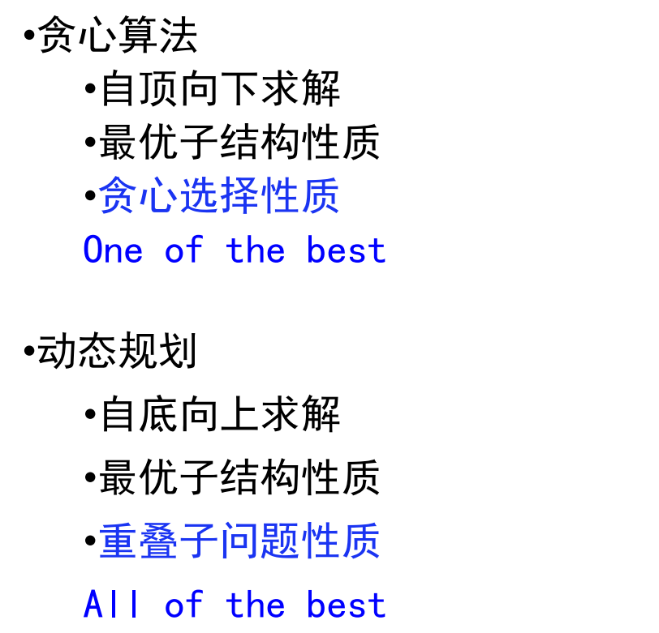

## 贪心选择性质的证明方法

贪心算法有两种证明方法：反证法和归纳法。一般情况下，一道题只会用到其中的一种方法来证明。

1. 反证法：如果交换方案中任意两个元素/相邻的两个元素后，答案不会变得更好，那么可以推定目前的解已经是最优解了。
2. 归纳法：先算得出边界情况（例如 n=1）的最优解$F_1$，然后再证明：对于每个n，$F_{n+1}$都可以由$F_n$推导出结果。

## 案例一活动安排

### 问题的定义

输入：活动数n，第$i$个活动的起始时间$s_i$和结束时间$f_i$
输出：最大相容集合$maxn$，各物品是否选择（0代表选，1代表不选）

约束条件：资源在同一时间只能为一个活动所使用，即每个活动**相容**，且**最大**

若区间$[si, fi)$与区间$[sj, fj)$不相交，则称活动i与活动j是相容的。即$s_i≥f_j$或$s_j≥f_i$时，活动i与活动j相容。


活动安排问题就是要在所给的活动集合中选出最大的相容活动子集合。

### 最优子结构性质分析

引理1：设$S={1,2,…,n}$是*n*个活动集合，$[s_i,f_i ]$是活动的起始终止时间，且$f_1≤f_2≤….≤f_n$，S的活动选择问题的**某个优化解包括活动1**.

设A是一个最优解，按照活动结束时间进行排序，设其中第一个活动是i，第二个活动是j

如果i=1，则引理成立

如果i≠1，令$B=A-{i}+{1}$,由于A中的活动彼此相容，所以有$f_i≤s_j$,那么加入1后，$f_1≤s_i<s_j$,那么加入后，|A|=|B|,则B也是问题的一个最优解，且包含活动1

说明引理1成立

引理2：设*A*是*S*的调度问题的一个优化解且包括活动*1*，则A’=A-{1}是S’={i**∈**S|si≥f1}的调度问题的优化解。

需要证明A'是问题的最优子结构，设A'不是S'的最优解，存在B'，|B'|>|A'|,令B={1}∪B'，对于任意i∈S',$s_i≥f_1$,B中活动相容，B是S的一个解，由于|A|=|A'|+1,|B|=|B'|+1>|A'|+1=|A|,那么A不是问题的最优解，与假设相矛盾，所以A'是问题的最优子结构

### 贪心选择性质

f[0] =0, $l_i$ 是 $S_i$={ j∈S | $s_j $≥ $f_{i-1}$} 中具有最小结束时间 $f_{li}$的活动.设*A*是*S*的包含活动*1*的优化解, 其中

$f_1≤...≤f_n$,则

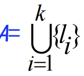

证明：对|A|作归纳法，

当|A|=1时，由引理1，命题成立

当|A|<k时，命题成立

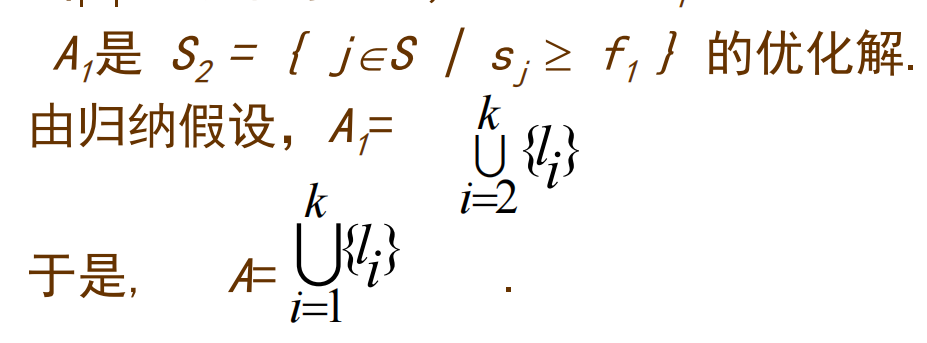

### 算法设计

输入的活动以其完成时间的**非减序**排列，每次总是选择**具有最早完成时间**的相容活动加入集合A中

直观上，按这种方法选择相容活动为未安排活动**留下尽可能多的时间**。也就是说，该算法的贪心选择的意义是**使剩余的可安排时间段极大化**，以便安排尽可能多的相容活动

### 时间复杂性

当输入的活动已按结束时间的非减序排列，算法只需**O(n)**的时间安排n个活动，使最多的活动能相容地使用公共资源。

若所给出的活动未按非减序排列，则需**O(nlogn)**的时间重排

### 算法正确度

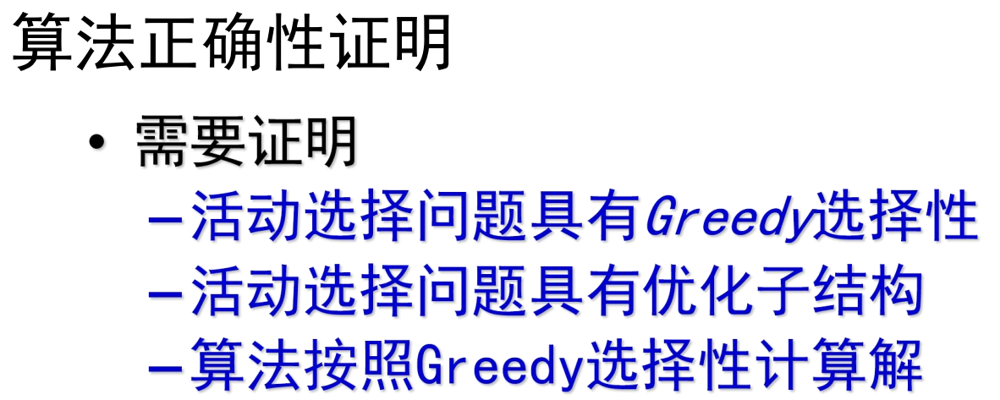

## 案例二分数背包问题

### 问题的定义

输入：背包容量c，物品数n,第i个物品的质量$w_i$,价值$v_i$

输出：maxv

约束条件：容量c，可以取背包的一部分

### 数据选择策略

1.效益大的优先：按效益值的**非增次序**将物品放入背包

2.重量小的优先：按物品重量的**非降次序**将物品放入背包

3.单位效益大的优先。即：将物品按$v_i/w_i$比值的**非增次序**装入背包。

### 算法思路

1).将各物体按**单位价值**由高到低排序.

2).取价值最高者放入背包.

3).计算背包剩余空间.

4).在剩余物体中取价值最高者放入背包. 若**背包剩余容量=0**或**物体全部装入背包**为止

```C++
#include<iostream>
#include<algorithm>
#include<iomanip>
using namespace std;
#define N 1000001
typedef long long ll;
ll n;
ll c;
struct object{
	ll w;
	ll v;
	double vpw;
};
object x[N]; 
bool cmp(const object &a,const object &b){
	return a.vpw>b.vpw;
}

double bag_greedy(int c,int n,object *x){
	object x1[n+1];
	for(int i=1;i<=n;i++){
	x1[i].w=x[i].w;
	x1[i].v=x[i].v;
	x1[i].vpw=x[i].vpw;
}
	double max;
	sort(x1+1,x1+n+1,cmp);
	for(int i=1;i<=n&&c>0;i++){
		if(x1[i].w<=c){
			max+=x1[i].v;
			c-=x1[i].w;
			//cout<<x1[i].w<<endl;
		}else{
			max+=x1[i].vpw*c;
			c=0;
		}
	}
	 return max;
}
int main(){
	cin>>n>>c;
	for(int i=1;i<=n;i++){
		cin>>x[i].w>>x[i].v;
		x[i].vpw=(double)x[i].v/x[i].w;
	}
	double max=bag_greedy(c,n,x);
	cout<<fixed<<setprecision(2)<<max;
}


```

### 01背包分析

贪心选择不能保证得到最优解，因为无法保证最终能将背包装满，**部分闲置的背包空间使每公斤背包空间的价值降低**

## 案例三最优装载问题

### 问题的定义

输入：装载质量c,集装箱数量n,各集装箱i的质量$w_i$

输出：最多的装载数量num

约束条件：体积不受约束，尽可能多的集装箱

### 算法思路

将装船过程划为多步选择，每步装一个货箱，每次从剩下的货箱中选择重量最轻的货箱.如此下去直到所有货箱均装上船或船上不能再容纳其他任何一个货箱。

### 时间复杂度

主要计算量在于将集装箱依其重量从小到大排序，故算法所需的计算时间为 O(nlogn)

## 案例四最优前缀编码树问题

### 问题的定义

二进制字符编码：每个字符用一个二进制0、1串来表示

可变长编码：经常出现的字符用短码，不经常出现的用长码

前缀编码：无任何字符的编码是另一个字符编码的前缀

①可以保证对压缩文件进行解码时不产生二义性，正确解码，

②可以节省储存空间

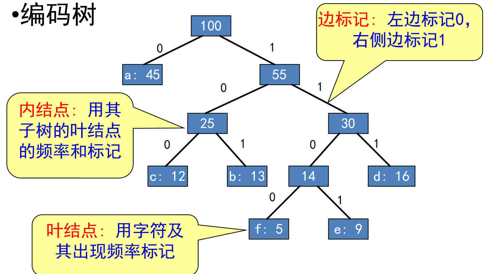

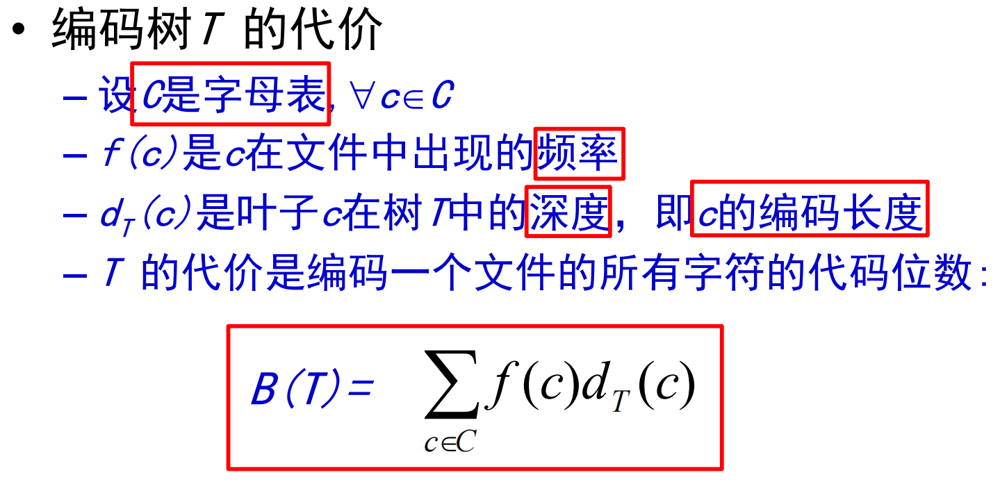

输入：字母表C={c1,c2,...,cn},频率表F={f1,f2,...,fn}

输出：具有最小B(T)的C前缀编码树

约束条件：最小代价

### 贪心思想

循环地选择具有**最低频率**的两个结点，生成一棵子树，直至形成树

### 最优子结构

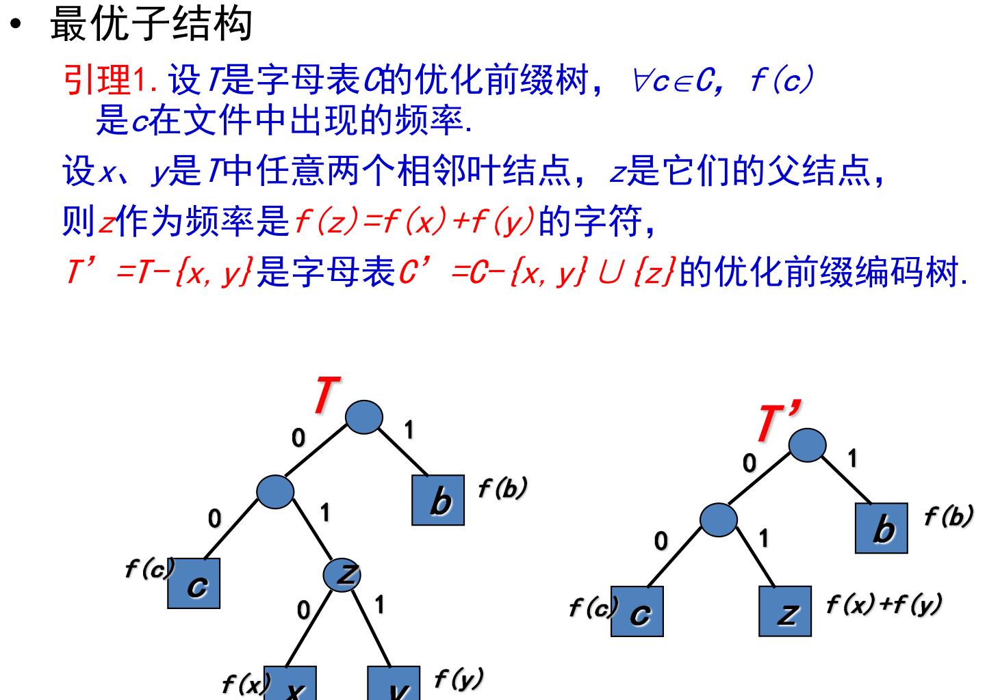

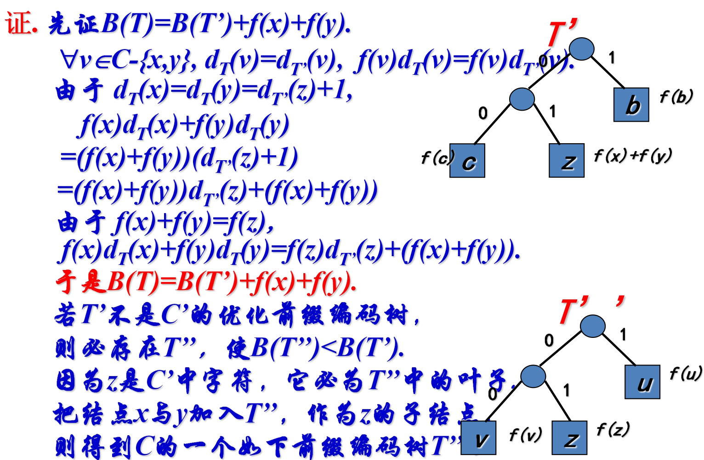

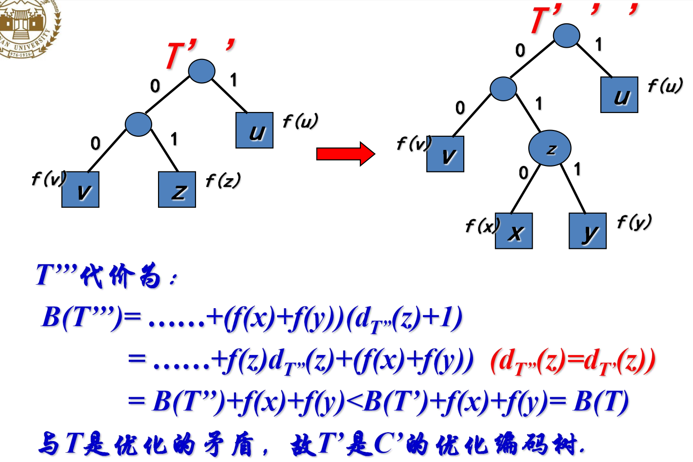

### 贪心选择性质

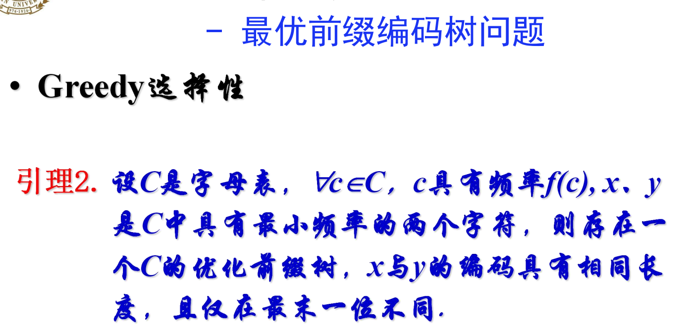

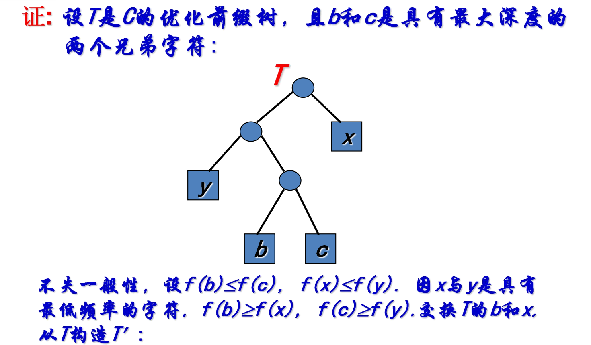

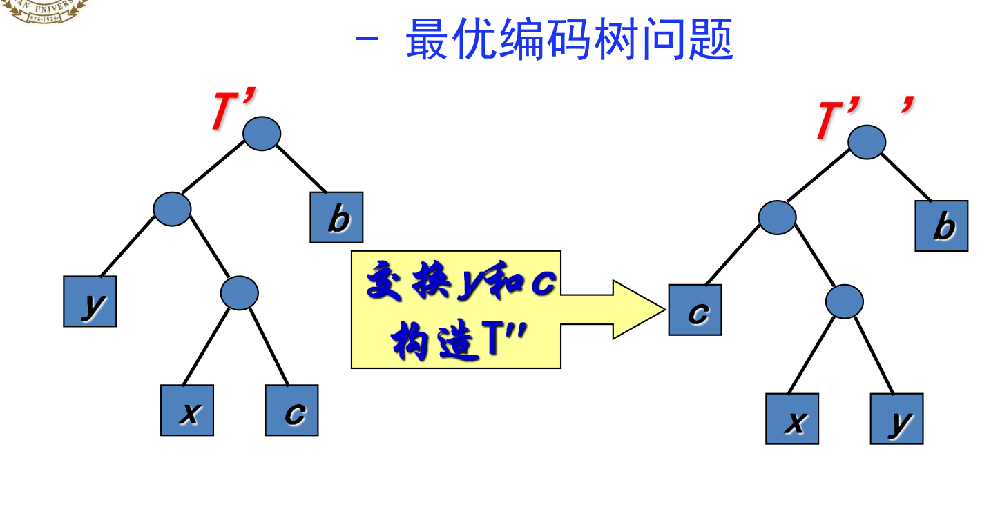

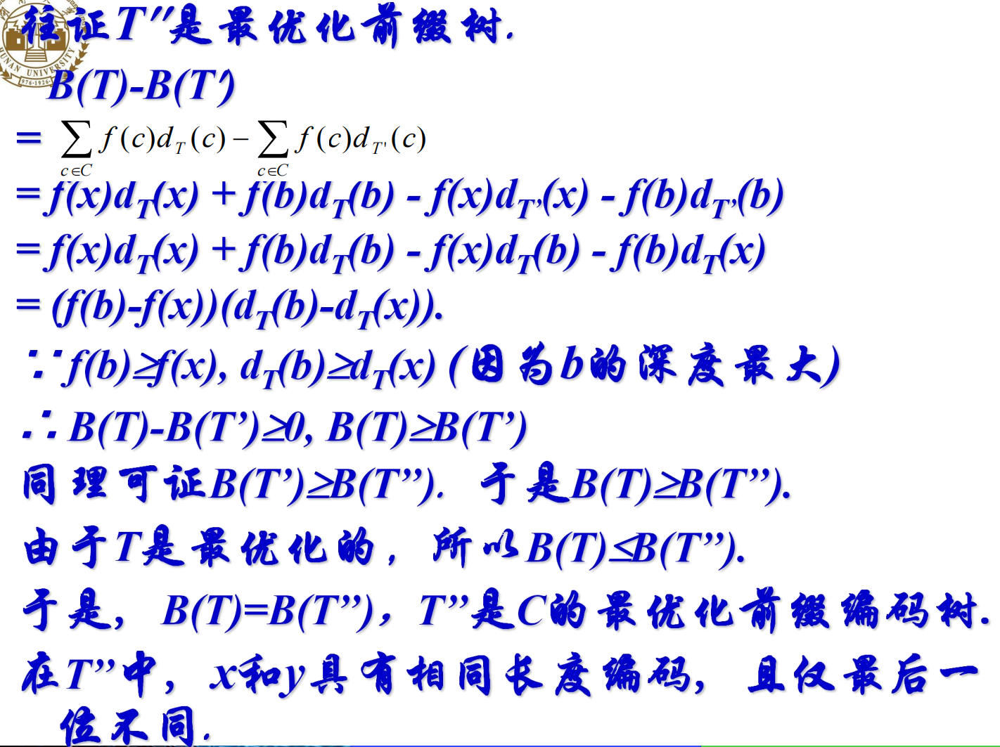

### 时间复杂度

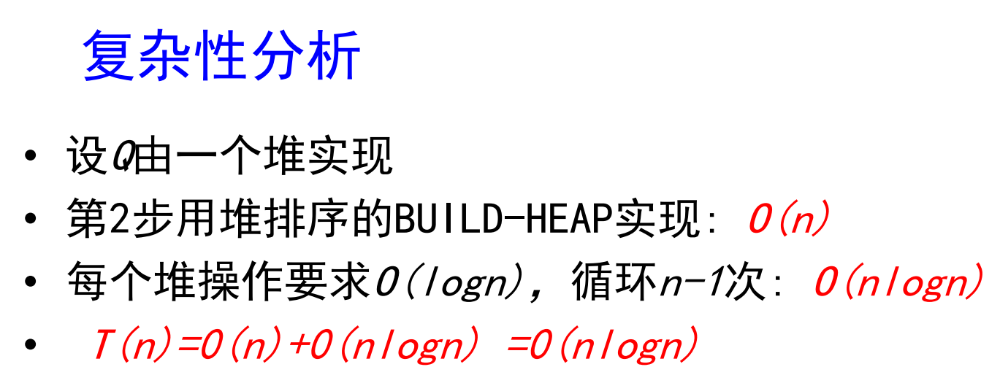

## 案例五最小生成树问题

### 问题的定义

输入：无向连通带权图

可行解:图的生成树

优化函数:生成树的各边权值之和

输出：使优化函数达到最小的生成树

约束条件：最小

### 贪心策略

#### Kruskal算法

```C++
#include<bits/stdc++.h>

using namespace std;
#define N 101
struct edge{
	int u;
	int v;
	int w;
};
struct edge e[N];
int n,m;
int f[N];
int sum,count1=0;
bool cmp(const edge &a,const edge &b){
	return a.w<b.w;
}
int getf(int x){
	if(f[x]==x)return x;
	else{
		f[x]=getf(f[x]);
		return f[x];
	}
}
int merge(int x,int y){
	int t1=getf(x);
	int t2=getf(y);
	if(t1!=t2){
		f[t2]=t1;
		return 1;
	}
	return 0;
}
int main(){
	cin>>n>>m;
	for(int i=1;i<=m;i++)cin>>e[i].u>>e[i].v>>e[i].w;
	sort(e+1,e+m+1,cmp);
	for(int i=1;i<=n;i++)f[i]=i;
	for(int i=1;i<=m;i++){
		if(merge(e[i].u,e[i].v)){
			count1++;
			sum+=e[i].w;
		}
		if(count1==n-1)break;
	}
	cout<<sum<<endl;	
}

```

#### prim算法

```C++
#include<bits/stdc++.h>

using namespace std;
#define N 101
int count1=0,sum=0;
int n,m;
int e[N][N];
int dis[N];
int book[N]={0};
int min1;
int j;
int main(){
	cin>>n>>m;
	for(int i=1;i<=n;i++)
		for(int j=1;j<=n;j++)
		if(i==j)e[i][j]=0;
		else e[i][j]=INT_MAX;
	int t1,t2,t3;
	for(int i=1;i<=m;i++){
		cin>>t1>>t2>>t3;
		e[t1][t2]=t3;
		e[t2][t1]=t3;
	}
	for(int i=1;i<=n;i++)dis[i]=e[1][i];
	
	book[1]=1;
	count1++;
	while(count1<n){
		min1=INT_MAX;
		for(int i=1;i<=n;i++){
			if(book[i]==0&&dis[i]<min1){
				min1=dis[i];
				j=i;
			}
		}
		book[j]=1;
		count1++;
		sum+=dis[j];
		for(int i=1;i<=n;i++){
			if(book[i]==0&&dis[i]>e[j][i])dis[i]=e[j][i];
		}
	}
	cout<<sum<<endl;
}

```

### 时间复杂度

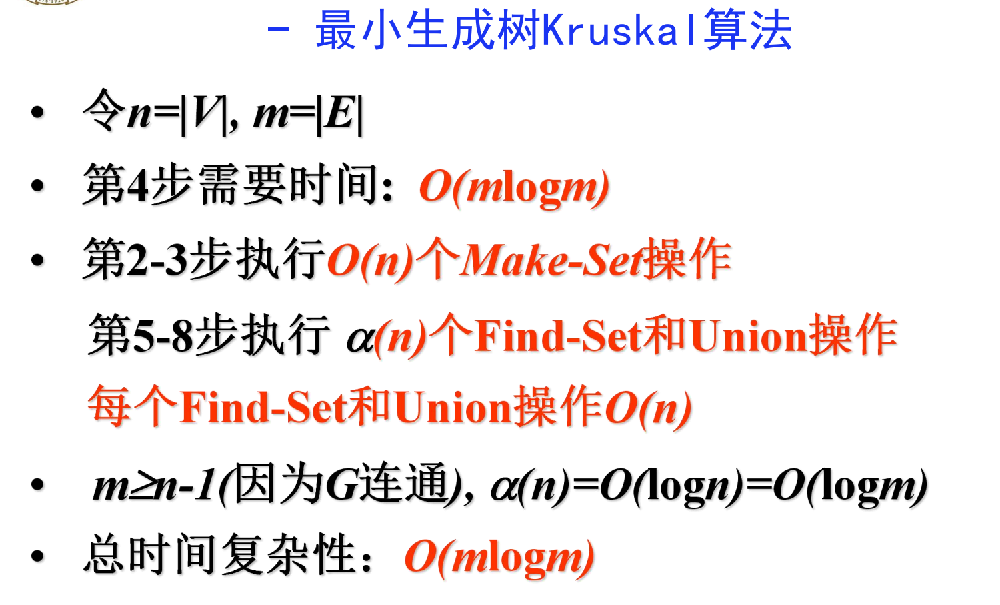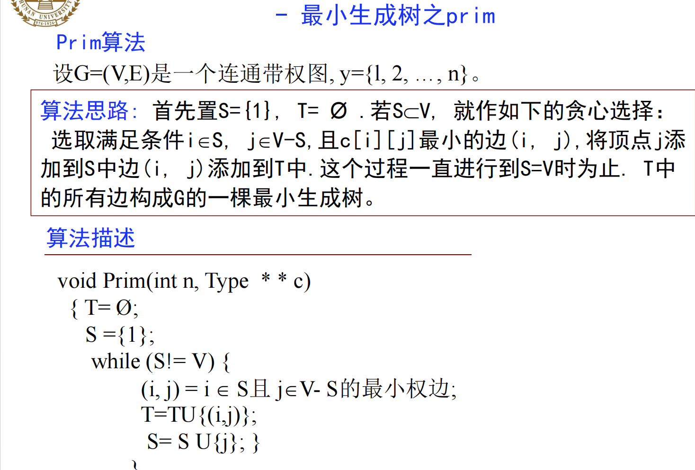

## 案例六单源最短路径问题

### 问题的定义

输入: 带权有向图，源$v_0$ 

输出: v0(源)到所有其它各顶点的最短路长度

约束条件：非负权

### 贪心策略

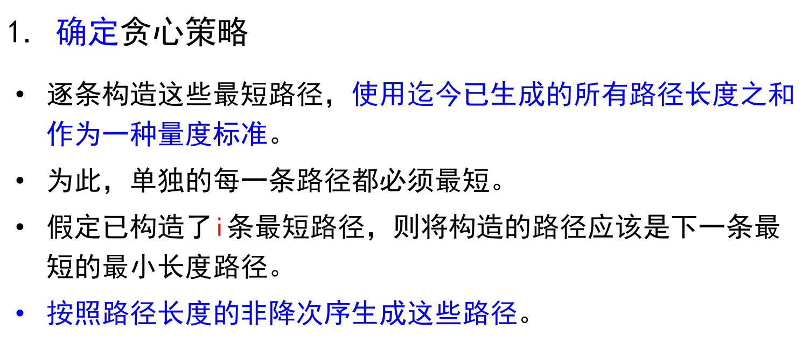

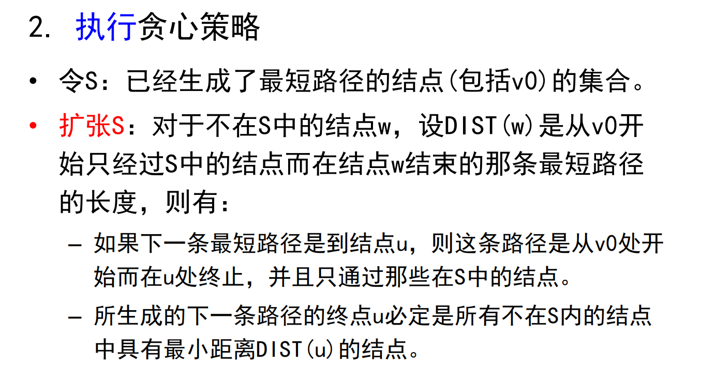

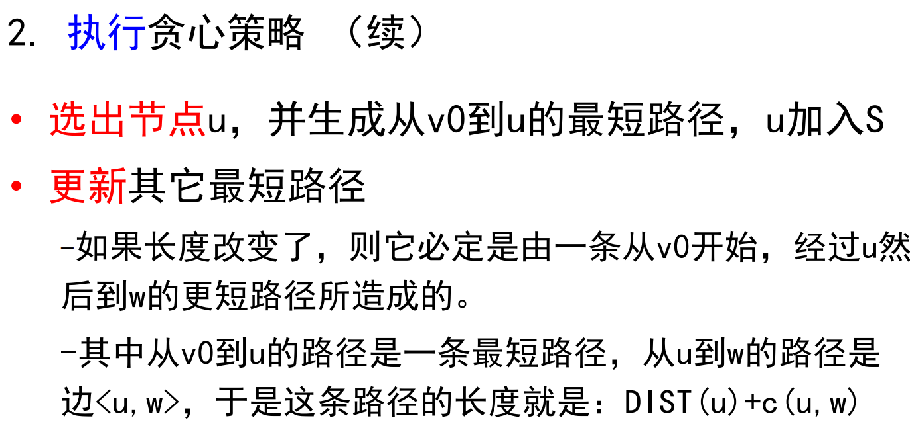

### 算法实现

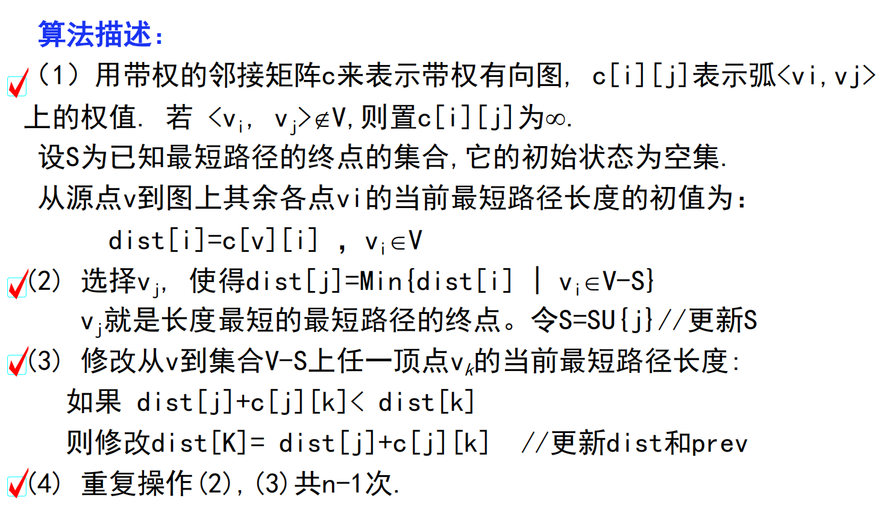

```C++
#include<iostream>
#include<climits>
#include<vector>
#include<queue>
using namespace std;
#define ll long long 
const int N=1e6+10;
const int M=5e6+10;
struct Edge{
	ll v;
	ll w;
	Edge(int v,int w){
		this->v=v;
		this->w=w;
	}
};
vector<Edge> e[N];

struct node{
	int dis;
	int pos;
	node(int dis,int pos){
		this->dis=dis;
		this->pos=pos;
	}
	bool operator()(const node &a,const node &b)const{
	return a.dis>b.dis;
}
};
struct cmp {
    bool operator()(const node& a, const node& b) {
        return a.dis > b.dis; 
    }
};
priority_queue<node, vector<node>, cmp> q;
bool book[N];
ll n,m,st;//顶点数，边数，起始节点
ll dis[N];//最短距离
ll pre[N];//该顶点的前序顶点
inline void dijkstra(){
	fill(dis, dis + N, INT_MAX); 
	dis[st]=0;
	q.push(node(0,st));
	while(!q.empty()){
		node t=q.top();
		q.pop();
		ll d=t.dis;
		int p=t.pos;
		if(book[p])continue;
		book[p]=1;
		int v;
		ll w;
		for(auto edge:e[p]){
			v=edge.v;
			w=edge.w;
			if(dis[p]+w<dis[v]){
				dis[v]=dis[p]+w;
				q.push(node(dis[v],v));
				pre[v]=p;
			}
		}	
	}
}


int main(){
	cin>>n>>m>>st;
	ll u,v,w;
	for(int i=1;i<=m;i++){
		cin>>u>>v>>w;
		e[u].push_back(Edge(v,w));
	}
	dijkstra();
	for(int i=1;i<=n;i++){
		if(dis[i]==INT_MAX)cout<<INT_MAX<<" ";
		else cout<<dis[i]<<" ";
	}
	cout<<"输入查询的节点路径：";
    int x=0;
    cin>>x;
    for(;x!=0;){
    	if(x==st){cout<<x;break;
		}
    	cout<<x<<"<-";
    	x=pre[x];
	}
	
}

```

### 时间复杂度

 $O((n+m)logn)$