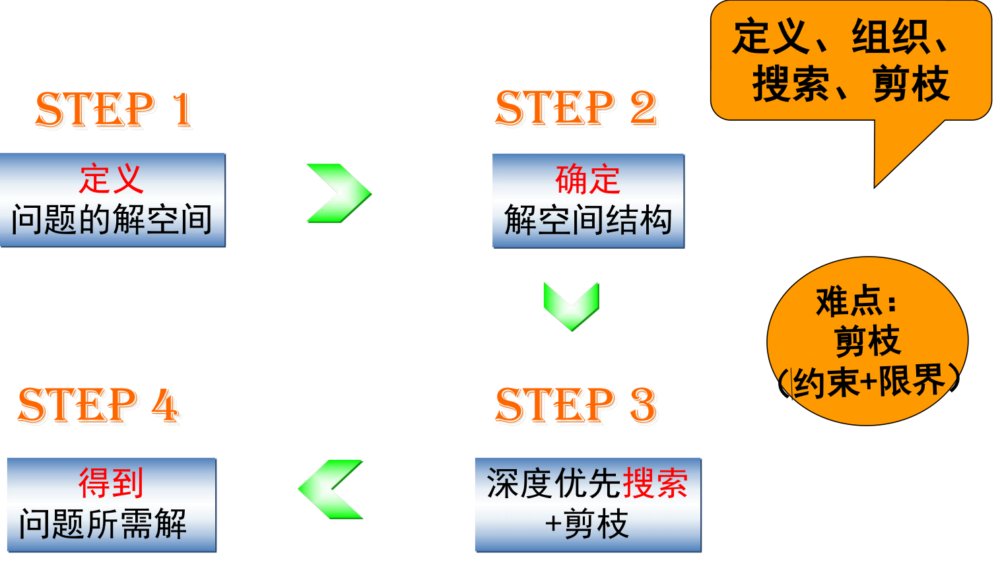
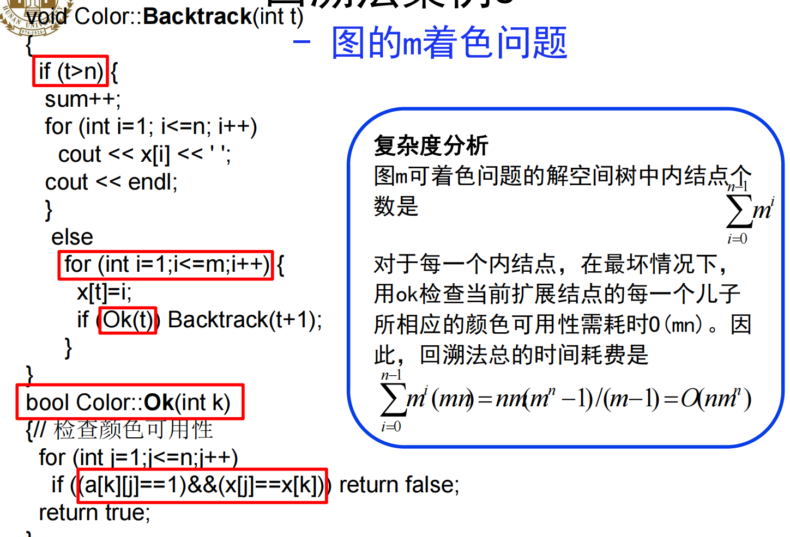
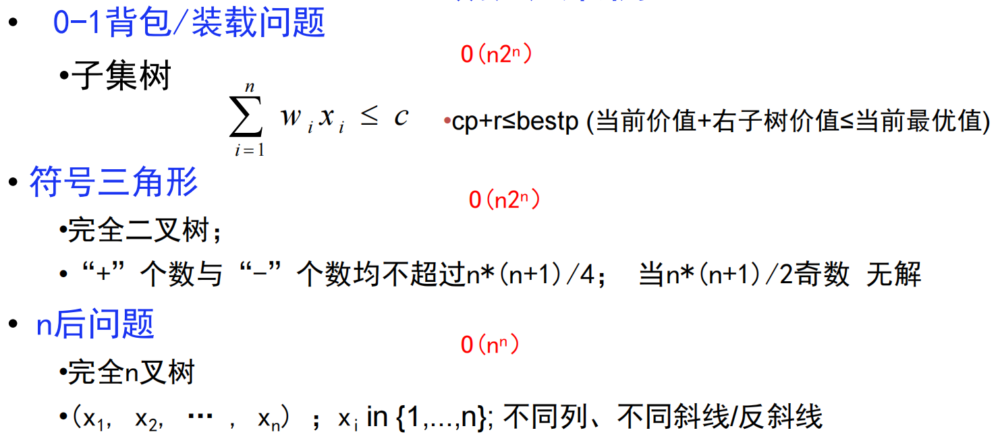
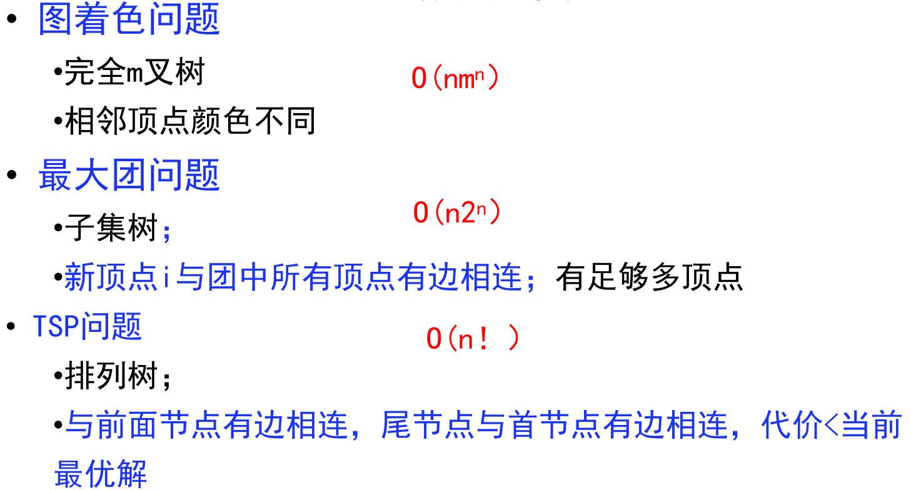

# 回溯



01背包，装载问题回溯法的时间复杂度

符号三角形问题：

计算可行性约束需要O(n)时间，在最坏情况下有 $O(2^n)$个结点需要计算可行性约束，故解符号三角形问题的回溯算法所需的计算时间为$O(n2^n)$。


## 案例时间复杂度总结

01背包/装载问题：$O(n2^n)$

符号三角形：$O(n2^n)$

n后问题：$O(n^n)$

图着色问题：$O(nm^n)$

最大团问题：$O(n2^n)$

TSP问题:$O(n!)$





**问题的解空间**

1. 解向量：问题的解用向量表示$(x_1,x_2,…,x_k)$，其中$k≤n$，$n$为问题的规模
2. 约束条件
   - 显式约束：对分量$x_i$的取值的明显限定
   - 隐式约束：为满足问题的解而对分量施加的约束
3. 解空间：对于问题的一个实例，解向量满足显式约束条件的所有多元组，构成了该实例的一个解空间。
4. 状态空间树：用于形象描述解空间的树
5. 目标函数与最优解
   - 目标函数：衡量问题解的“优劣”标准
   - 最优解：使目标函数取极（大/小）值的解

**回溯法**

- 基本方法：利用限界函数来避免生成那些实际上不可能产生所需解的活结点，以减少问题的计算量，避免无效搜索
- 限界函数：用于剪枝
  1. 约束函数：某个满足条件的表达式或关系式
  2. 限界函数：某个函数表达式或关系式
- 回溯法：具有限界函数的深度优先搜索方法
- 基本思想
  1. 以深度优先方式搜索解空间
  2. 开始时，根节点为活结点，也是当前的扩展结点
  3. 对扩展结点，寻找儿子结点：若找到新结点，新结点称为活结点并成为扩展结点，转3；若找不到新结点，当前结点成为死结点，并回退到最近的一个活结点，使它成为扩展结点，转3
  4. 搜索继续进行，直到找到所求的解或解空间中已无活结点时为止
- 解题步骤
  1. 针对所给问题，定义问题的解空间
  2. 确定合适的解空间结构
  3. 以深度优先方式搜索解空间，并在搜索过程中用剪枝函数避免无效搜索，直到找到所求的解或解空间中已无活结点时为止

**子集树与排列树**


左图为子集树，遍历子集树需计算$O(2^n)$；右图为排列树，遍历排列树需要$O(n!)$

```
//legal(t)为Constraint(t)&&Bound(t)
//子集树
void backtrack(int t)
{
    if (t>n) output(x);
    else
        for(int i=0;i<=1;i++)
        {
            x[t]=i;
    		if(legal(t))
                backtrack(t+1);
		}
}

//排列树
void backtrack(int t)
{
    if(t>n) output(x);
    else
        for(int i=t;i<=n;i++)
        {
            swap(x[t],x[i]);
            if(legal(t))
                backtrack(t+1);
            swap(x[t],x[i]);
		}
}
```

### 5.2 装载问题

**问题描述**

有一批共n个集装箱要装上2艘载重量分别为$c_1$和$c_2$的轮船，其中集装箱i的重量为$w_i$，且$\sum_{i=1}^{n}{w_i≤c_1+c_2}$

**最优装载方案**

1. 首先将第一艘轮船尽可能装满
   - 将第一艘轮船尽可能装满等价于选取全体集装箱集合的一个子集，使该子集中集装箱重量之和最接近$c_1$
2. 将剩余的集装箱装上第二艘轮船

装载问题等价于特殊的0-1背包问题

**装载问题的回溯法**

- 解空间：子集树，完全二叉树
- 设定解向量：$(x_1,x_2,…,x_n)$
- 约束条件
  1. 显式约束：$x_i=0,1(i=1,2,…,n)$
  2. 隐式约束：无
- 约束函数（整体）：$\sum^{n}_{i=1}{w_ix_i}≤c_1$

```
/*
cw:当前载重量
bestw:当前最优载重量
r:剩余集装箱的重量，限界函数:cw+r>bestw
*/
//求最优值
void backtrack(int i)						//搜索第i层结点
{
    if(i>n)									//到达叶结点
    {
        if(cw>bestw) bestw=cw;				//修正最优值
        return;
	}
    r-=w[i];
    if(cw+w[i]<=c)							//搜索左子树
    {
        cw+=w[i];
        backtrack(i+1);
        cw-=w[i];							//回退
	}
    if(cw+r>bestw)							//搜索右子树
    	backtrack(i+1);	
    r+=w[i];
}
```

为了构造最优解，需在算法中记录与当前最优值相对应的当前最优解。

```
/*
cw:当前载重量
x:当前解
bestx:当前最优解
bestw:当前最优载重量
r:剩余集装箱的重量，限界函数:cw+r>bestw
*/
void backtrack(int i)
{
    if(i>n)
    {
        if(cw>bestw)
            for(int j=1;j<=n;j++)
                bestx[j]=x[j];			//记录路径
        	bestw=cw;
        return;
	}
    r-=w[i];
    if(cw+w[i]<=c){						//搜索左子树
		x[i]=1;
        cw+=w[i];
        backtrack(i+1);
        cw-=w[i];
    }
    if(cw+r>bestw){						//搜索右子树
		x[i]=0;
        backtrack(i+1);
    }
    r+=w[i];
}
```

**迭代回溯**

*注：代码见书P 130*

- 将回溯法表示成非递归的形式
- 所需计算时间仍为$O(2^n)$
- 优化：修改递归回溯程序，使所需的计算时间仍为$O(2^n)$

### 5.3 批处理作业调度

**问题描述**

给定n个作业的集合$J=${$J_1,J_2,…,J_n$}，每个作业须由机器M1处理，再由机器M2处理。作业$J_i$需机器j的处理时间为$t_{ji}$.所有作业在机器M2上完成处理的时间和称为该作业调度的完成时间和。 \(f=\sum_{i=1}^{n}{F_{2i}}\) **算法设计**

设x[1…n]是n个作业，解空间为排列树

$f1=f1+m[x[j]][1]$

$f2[i]=((f2[i-1]>f1)?f2[i-1]:f1)+m[x[j]][2]$

```
/*
f1:机器1完成处理时间
f：完成时间和
bestf:当前最优值
m:各作业所需的处理时间
x:当前作业调度
bestx:当前最优调度
f2:机器2完成处理
*/
void backtrack(int i)
{
    if(i>n){
		for(int j=1;j<=n;j++)
            bestx[j]=x[j];
        bestf=f;
    }
    else
    {
        for(int j=i;j<=n;j++){
			f1+=M[x[j]][1];
            f2[i]=((f2[i-1]>f1)?f2[i-1]:f1)+M[x[j]][2];
            f+=f2[i];
            if(f<bestf)
            {
                Swap(x[i],x[j]);
                backtrack(i+1);
                Swap(x[i],x[j]);
			}
            f1-=M[x[j]][1];
            f-=f2[i];
        }
	}
}
```

### 5.5 n后问题

**问题描述**

在n×n格的棋盘上放置彼此不受攻击的n个皇后，任何两个皇后不放在同一行或同一列或同一斜线上

**算法分析**

1. 设定解向量：$(x_1,x_2,…,x_n)$，采用排列树

2. 约束条件

   - 显式约束：$x_i=1,2,…,n(i=1,2,…,n)$

   - 隐式约束

     - 不同列：$x_i≠x_j$

     - | 不处于同一正、反对角线：$ | i-j  | ≠    | x_i-x_j | $    |
       | ------------------------- | ---- | ---- | ------- | ---- |
       |                           |      |      |         |      |

```
/*
n:皇后个数
x:当前解
sum:当前已找到的可行方案书
*/

//约束函数
bool place(int k)
{
    for(int j=1;j<k;j++){
        if((abs(k-j)==abs(x[j]-x[k])) || (x[j]==x[k]))
            return false;
        return true;
    }
}

//递归回溯
void backtrack(int t)
{
    if(t>n) sum++;
    else
    {
        for(int i=1;i<=n;i++)
        {
            x[t]=i;
            if(place(t))
                backtrack(t+1);
		}
    }
}
```

**迭代回溯**

```
void N-queen(n){
	x[1]=0;
    k=1;
    while(k>0){
		x[k]=x[k]+1;
        while((x[k]<=n)&&!place(k))
            x[k]=x[k]+1;
        if(x[k]<=n)
            if(k==n) sum++;
        	else
                k=k+1;
        		x[k]=0;
        else
            k--;
    }
}
```

### 5.6 0-1背包问题

解空间：子集树

```
double bound(int i)						//计算上界
{
    double cleft=c-cw;					//剩余容量
    double bnd=cp;						//cp:当前价值
    while(i<=n && w[i]<=cleft)			//以物品单位重量价值递减序装入物品
    {
        cleft-=w[i];
        bnd+=p[i];
        i++;
    }
    if(i<=n && w[i]>cleft)				//背包有空隙时，装满背包
        bnd+=p[i]*cleft/w[i];
    return bnd;
}

//回溯程序
void Backtrack(int i)
{
    if(i>n)
        bestp=cp;
    	return;
    if(cw+w[i]<=c)
    {
        cw+=w[i];
        cp+=p[i];
        Backtrack(i+1);
        cw-=w[i];
        cp-=p[i];
	}
    if(bound(i+1)>bestp)
        Backtrack(i+1);
}
```

### 5.7 最大团问题

**算法分析**

解空间：子集树

限界函数：取cn+n-i，即有足够多的可选择顶点使得算法有可能在右子树中找到更大的团

```
void backtrack(int i)
{
    if(i>n)
    {
        for(int j=1;j<=n;j++)
            bestx[j]=x[j];
        bestn=cn;
        return;
	}
    int ok=1;
    for(int j=1;j<i;j++)				//欲扩展节点i
    {
        if(x[j]==1 && !a[i][j])			//考察：i与前面的j是否相连
        {
            ok=0;						//i与前面的j不相连，舍弃i
            break;
		}
        if(ok)							//进入左子树
        {
            x[i]=1;
            cn++;
            backtrack(i+1);
            x[i]=0;
            cn--;
		}
        if(cn+n-i>bestn)				//进入右子树
        {
            x[i]=0;
            backtrack(i+1);
        }
	}
}
```

### 5.8 图的m着色问题

**算法分析**

```
void backtrack(int t)
{
    if(t>n){sum++;输出解}
    else
    {
        for(int i=1;i<=m;i++)
        {
            x[t]=i;
            if(ok(t)) backtrack(t+1);
		}
    }
}

bool ok(int k)
{
    for(int j=1;j<=n;j++)
    {
        if(a[k][j] && (x[j]==x[k]))
            return false;
	}
    return true;
}
```