# 随机化算法


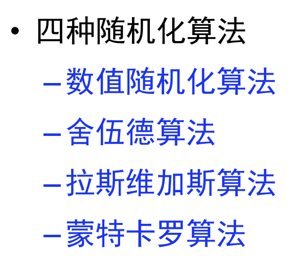

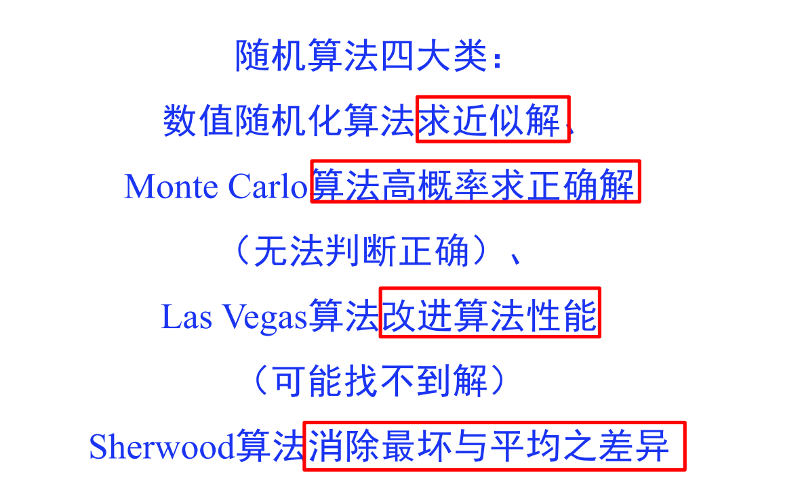

## 随机算法的随机性（基本特征）

– 对于同一实例的多次执行, 效果可能完全不同

– 时间复杂性的一个随机变量

– 解的正确性和准确性也是随机的


## 数值随机化算法

随机数值算法

– 主要用于**数值问题**求解

– 算法的输出往往是**近似解**

– 近似解的**精确度**与**算法执行时间**成正比

### 案例一 近似计算圆周率

用随机投点法近似计算圆周率

– 向方框内随机掷点$x=r(0,1), y=r(0,1) $

– 落在圆内概率$π/4 $

– 近似值 ≈ 圆内点数$c $/ 总点数$n$​,**n越大，近似度越高**

```C++
#include<iostream>
#include<random>
using namespace std;

double moni(int n){
	random_device rd;
	mt19937 gen(rd());
	int k=0;
	for(int i=1;i<=n;i++){
	uniform_real_distribution<> dis(-1.0, 1.0);
	double x=dis(gen);
	double y=dis(gen);
	if(x*x+y*y<=1)k++;
	}
	return 4*k/double(n);
}
int n;
int main(){
	cin>>n;
	cout<<moni(n)<<endl;
}

```

经过对n的不同测试，得到的结果越来越精确，但是随着n数据规模的增大，算法执行时间增大，解的精确度也增大。

### 案例二计算定积分

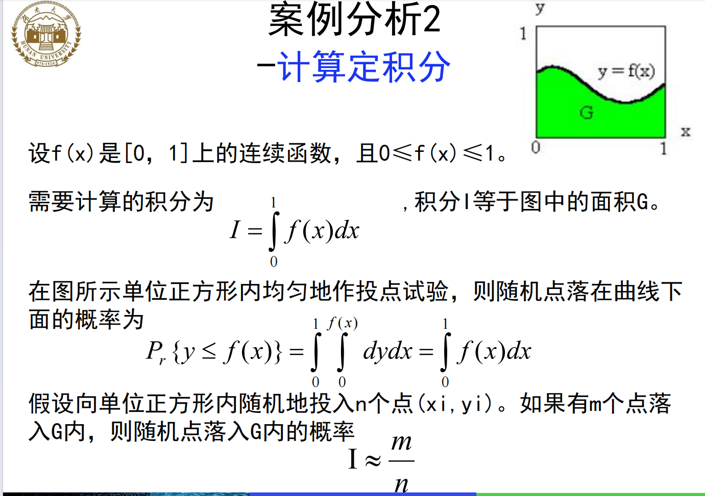

同样是算法运行时间越长，得到的近似解越精确。

## 蒙特卡洛算法

Monte Carlo算法

– 主要用于求解**需要准确解**的问题

– 算法**可能给出错误解**

– 获得精确解**概率**与**算法执行时间**成正比

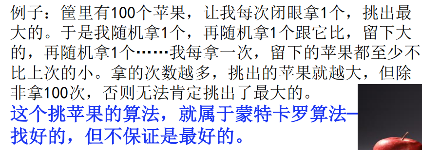

在实际应用中常会遇到一些问题，不论**采用确定性算法或随机化算法**都无法保证每次都能得到正确的解答。蒙特卡罗算法则在一般情况下可以**保证对问题的所有实例都以高概率给出正确解**，但是**通常无法判定一个具体解是否正确**。

设p是一个实数，且$1/2<p<1$。如果一个蒙特卡罗算法**对于问题的任一实例得到正确解**的概率不小于p，则称该蒙特卡罗算法是p正确的，且称$p-1/2$是该算法的优势。

如果对于同一实例，蒙特卡罗算法**不会给出2个不同的正确解答**，则称该蒙特卡罗算法是**一致的**。

对于一个**一致的p正确**蒙特卡罗算法，要提高获得正确解的概率，只要执行该算法若干次，并选择出现频次最高的解即可

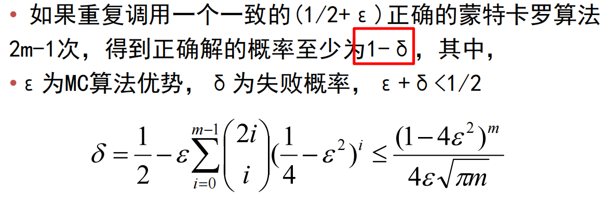

有些蒙特卡罗算法除了具有**描述问题实例的输入参数**外，还具有**描述错误解可接受概率的参数**。这类算法的计算**时间复杂性**通常**由问题的实例规模以及错误解可接受概率**的函数来描述。

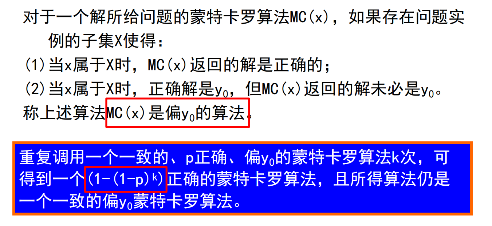

### 案例一主元素问题

设$T[1:n]$是一个含有n个元素的数组。当{i|T[i]=x}|>n/2时，称元素x是数组T的主元素

```C++
#include <iostream>
#include <random>
#include <cmath>
using namespace std;

const int N = 1e6 + 1;
int n;
int a[N];

bool majority(int n, int &num) {
    random_device rd;
    mt19937 gen(rd());
    uniform_int_distribution<> dis(0, n - 1);
    int id = dis(gen);
    num = a[id];
    int k = 0;
    for (int i = 0; i < n; i++) {
        if (a[i] == num) k++;
    }
    return k > n / 2;
}

bool majorityMC(int n, double e, int &num) {
    int k = ceil(log(1 / e) / log(2.0));
    for (int i = 0; i < k; i++) {
        if (majority(n, num)) {
            num = a[i]; // 这里需要更新num的值
            return true;
        }
    }
    return false;
}

int main() {
    cin >> n;
    for (int i = 0; i < n; i++) cin >> a[i];
    double e = 0.001;
    int num;
    if (majorityMC(n, e, num))
        cout << "该数组的主元素为：" << num << endl;
    else
        cout << "该数组没有主元素" << endl;
}
```


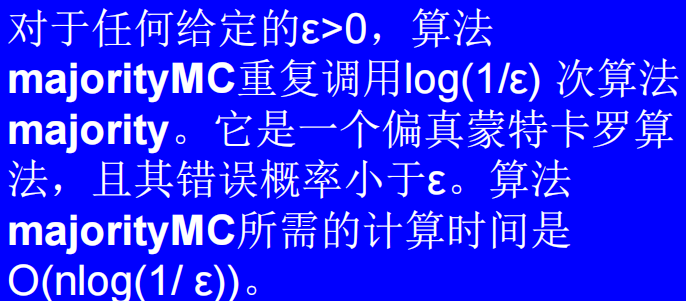

## 拉斯维加斯算法

**一旦找到一个解, 该解一定是正确的**

–**找到解的概率**与**算法执行时间**成正比

–增加对问题反复求解次数, **可使求解无效的概率任意小**

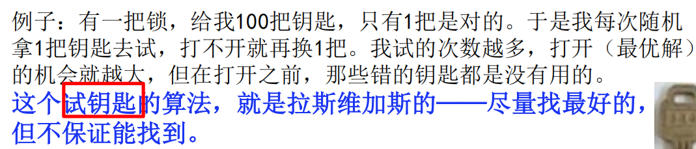

它所作的随机性决策有可能**导致算法找不到所需的解**,但是找到一个解，这个解一定是正确的

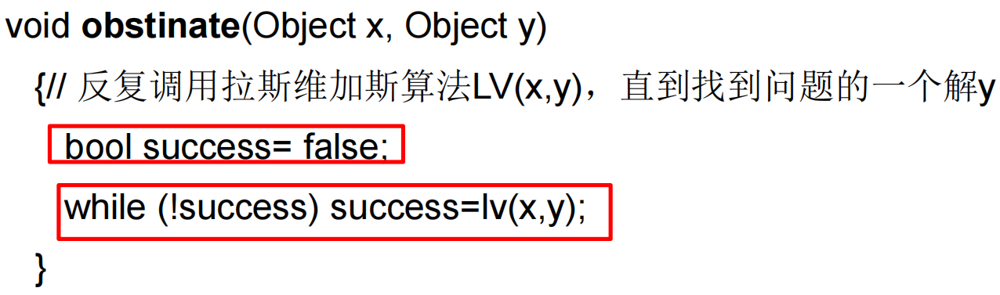

设$p(x)$是对输入x调用拉斯维加斯算法获得问题的一个解的概率，一个正确的拉斯维加斯算法应该对所有输入x均有$p(x)>0$。

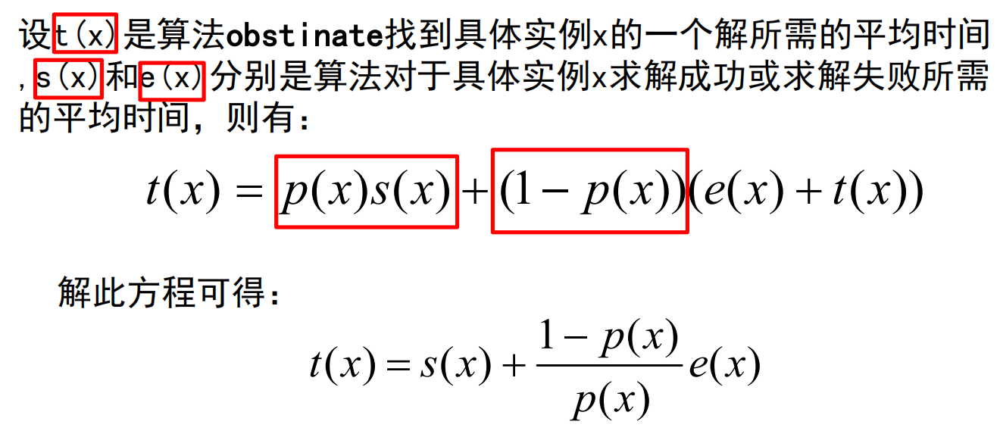

针对该方程的解释，特别是$(e(x)+t(x))$部分

- 算法可能需要多次尝试才能成功，每次尝试都有一定的失败概率。
- **每次失败后，算法需要重新开始，这增加了额外的时间开销。**
- 算法的平均运行时间取决于**成功的概率 $p(x)$**和**失败后需要重新开始的次数**。

### 案例一n后问题

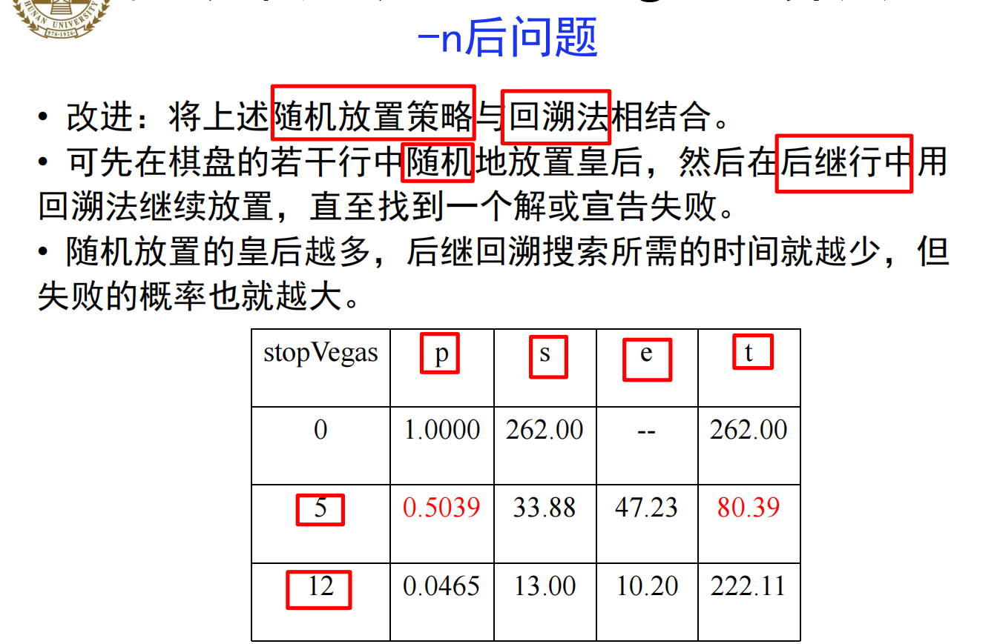

## 舍伍德算法

–一定能够**求得一个正确解**

–确定**算法的最坏与平均复杂性差别大**时, 加入随机性, 即得到Sherwood算法

–**消除最坏行为与特定实例**的联系，**消除最差情况和平均情况下的差异**

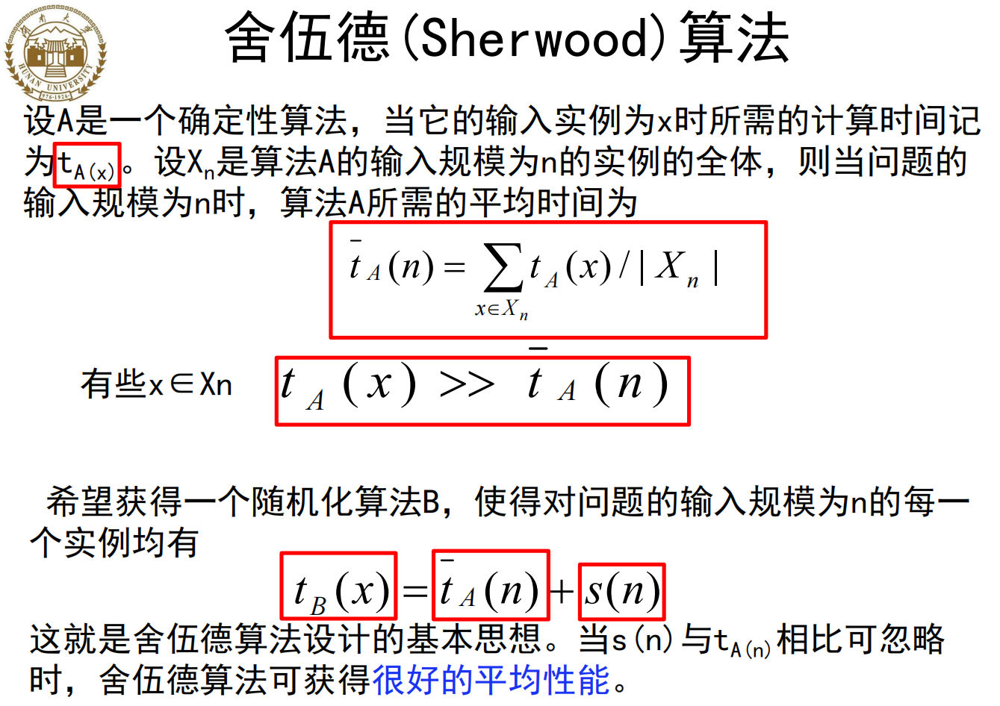

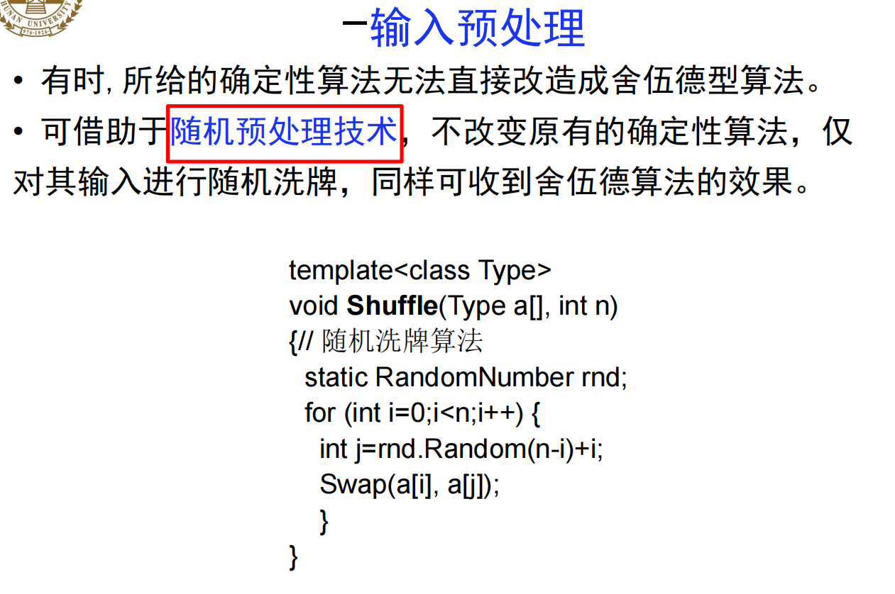

```C++
#include <iostream>
#include <time.h> 
#include <stdlib.h>
#include<algorithm>
using namespace std;


template<class Type>
Type select(Type a[], int n,int l, int r, int k){//左边界，右边界，第k位元素
	if(k<1||k>n){
		printf("Index out of bounds\n");
		exit(0);
	}
	n=n-1;
	while (true){
		if (l >= r)return a[l];
		//随机选择划分基准
		int i = l, j = l + rand() % (r - l + 1);//j选择为l到r的任意值[l,r]
		swap(a[i], a[j]);//与首元素交换位置
		j = r + 1;
		Type pivot = a[l];
		//以划分基准为轴做元素交换
		while (true){
			while (i<r&&a[++i] < pivot);
			while (j>l&&a[--j] > pivot);
			if (i >= j){
				break;
			}
			swap(a[i], a[j]);
		}
		//如果最后基准元素在第k个元素的位置，则找到了第k小的元素 
		if (j - l + 1 == k){
			return pivot;
		}	
		//a[j]必然小于pivot,做最后一次交换，满足左侧比pivot小，右侧比pivot大
		a[l] = a[j];
		a[j] = pivot;		
		//对子数组重复划分过程
		if (j - l + 1 < k){
			k = k - (j - l + 1);//基准元素右侧,求出相对位置 
			l = j + 1;
		}else{//基准元素左侧 
			r = j - 1;
		}
	}
}
 
 
int main(){
	int n,k,r;
	while(cin>>n){
		cin>>k;
		int a[n];
		for(int i=0;i<n;i++)
			cin>>a[i];
		r=select<int> (a,n,0,n-1,k);
		cout<<r<<endl;
	}
	return 0; 
}
```

